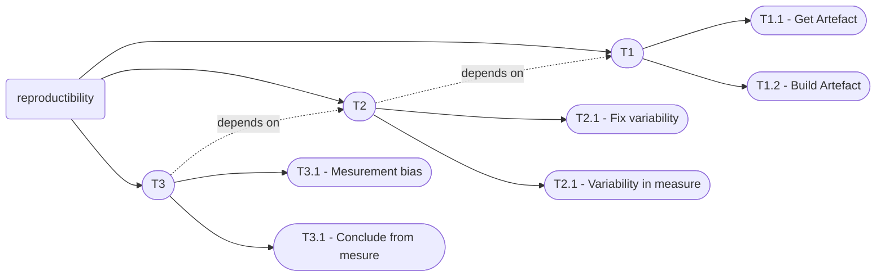

Reproductible Science - groupe 3
================================

Questions ouvertes:
- problème du warm-up 
- problème de la définition de l'objectif à mesurer (impact sur les outils choisis, niveau de précision de la description du protocole expérimental)

## Catégorie d'artefact

- C1 - physique (partage de la plateforme physique particulière ex: grid5000, digital twin qui doit être connecté)
- C2 - hardware
- C3 - Kernel
- C3 - OS
- C4 - Build system(s)
- C5 - Application
- Protocol
- C6 - Data input
- C7 - Dependecies

## Stockage

Problème de la pérennité, gestion du groupe des maintainer

ex: git, donner aussi une information précise du hash (et pas seulement le dépot)

## Procédure/protocole expérimental

P1 - Description de l'environnment de build/d'obtention de l'environnement d'execution (ex cas de la cross compilation)

P2 - Description de l'environnment d'execution

P3 - Description des données d'entrées (où les récupérer, comment les régénérer)

## Liste d'outils et techniques

- T1 : outils/techniques de reproduction d'artefact
  - ( T1.1 : pouvoir refaire un artefact à l'identique)
  - ( T1.2 : pouvoir obtenir (depuis un dépot) un artefact à l'identique)
(:warning: le temps n'importe pas, seul l'artefact produit compte)
- T2 : outils/techniques permettant de limiter les points de variabilité de l'execution de l'expérimentation (à priori, le temps peut compter) 
    - T2.1 : outils ou technique de mesure
    - T2.2 : outil pour fixer les point de variabilité
- T3 : outils/techniques d'alignement des résultats (aider à arriver à la même conclusion même si les résultats précis diffèrent) (statistiques, ...)
    - T3.1 : Addresser le biais de mesure
        - [Measurment Bias](https://users.cs.northwestern.edu/~robby/courses/322-2013-spring/mytkowicz-wrong-data.pdf)
Producing wrong data without doing anything obviously wrong!
Todd Mytkowicz, Amer Diwan, Matthias Hauswirth, and Peter F Sweeney.
    - T3.2 : Conclure à partir des donnée

T3 utilise/s'appuie T2 (dont T2.2)
T2 utilise les outils de T1

wattmetre (T2.1)
krun (reduit la variabilité niveau os/hardware + protocole) T2
Guix T1.1
docker file - T1.1
VMware - T1.2
docker hub/registry - T1.2
git/svn - T1.2
Apptainer/Singularity (container) - T1.1
ansible - T1.1
pip env - T1.2
conda - T1.2
figshare - T1.2
zenodo - T1.2
SoftwareHeritage & al. - T1.2
rapl (mesure précise de consomation energetique) - T2.1
nix T1.1
JMH(framework to avoid performance mesurment pitfalls) - T2.1
Snakemake (workflow manager), [mlflow](https://mlflow.org/) (store ml models and inputs parameters) Nextflow ? T1.1
git-lfs, [DVC](https://github.com/iterative/dvc) - T1.1
[hyperfine](https://github.com/sharkdp/hyperfine) - T2.1

Pratique d'utilisation de xxx
ex:  Fix version range of dependencies  (mvn, npm, ...) - T2.1

techniques:
- techniques statistiques: T3

Grid5000 T2?
[watermark](https://github.com/rasbt/watermark) T1.1
to track all version numbers, hardware information, and date and time stamps in python.

## Taxonomie des outils de gestion/controle de la variabilité

Distinguer la description (de la dépendance, de l'environnment, des donnée) du mécanisme d'obtention (évidemment on va privilégier les outisl qui associent les 2)

:warning: on a tendance à concevoir/écrire le protocole aprés avoir fait les xp, du coup on ne remonte pas toujours toute la chaine des éléments (à tort ou a raison,) sans toujours décrire pourquoi on ne décrit pas ce niveau, le sens de construction du protocole est dans e cas inverse de celui de lecture du protocole

- outils (ou techniques) de controle du warm-up
- outils (ou techniques) de controle de l'environnment d'exécution
  - outils de gestion des dépendances 
      - distinguer la description de la dépendance du mécanisme d'obtention (à généraliser pas juste pour les dépendances, application pour les environnment, les données)
- 
- 
- outils (ou techniques) de stockage des données

## Papers

[Best Practices for Replicability,Reproducibility and Reusability of Computer-Based Experiments Exemplified by Model Reduction Software](https://arxiv.org/pdf/1607.01191.pdf)
  
[Rapl in action : Experiences in using rapl for power measurements](https://dl.acm.org/doi/10.1145/3177754) 
Kashif Nizam Khan, Mikael Hirki, Tapio Niemi, Jukka K Nurminen,
and Zhonghong Ou. Rapl in action : Experiences in using rapl for power measurements. ACM Transactions on Modeling and Performance
Evaluation of Computing Systems (TOMPECS), 3(2) :1–26, 2018

[VMSH: Hypervisor-agnostic Guest Overlays for VMs](https://redha.gouicem.fr/publication/vmsh/vmsh.pdf): Appendix A: Artifact Appendix, especially A.2 Description & Requirements

[Inital state in benchmarks](https://scholar.google.com/scholar?oi=bibs&cluster=965230305512157864&btnI=1&hl=en) : Benchmark precision and random initial state - 
Tomas Kalibera, Lubomir Bulej, Petr Tuma

[Reproduce evolution of the execution platform](https://dri.es/files/oopsla08-georges.pdf)
Java performance evaluation through rigorous replay compilation.
A. Georges, L. Eeckhout, and D. Buytaert.

[Measurment Bias](https://users.cs.northwestern.edu/~robby/courses/322-2013-spring/mytkowicz-wrong-data.pdf)
Producing wrong data without doing anything obviously wrong!
Todd Mytkowicz, Amer Diwan, Matthias Hauswirth, and Peter F Sweeney. 

[Statistical framework to design experiments](https://kar.kent.ac.uk/33611/45/p63-kaliber.pdf)
Rigorous benchmarking in reasonable time -
Tomas Kalibera, Richard Jones

[Bayesian in empirical science](https://arxiv.org/pdf/1811.05422.pdf)
Bayesian Data Analysis in Empirical Software Engineering Research
Carlo A. Furia, Robert Feldt, Richard Torkar

[Reproducible toolchain for network experiments](https://dl.acm.org/doi/pdf/10.1145/3485983.3494841)
The pos framework: a methodology and toolchain for reproducible network experiments.

[Tools and techniques for computational reproducibility](https://gigascience.biomedcentral.com/track/pdf/10.1186/s13742-016-0135-4.pdf)

https://github.com/google/benchmark

---
